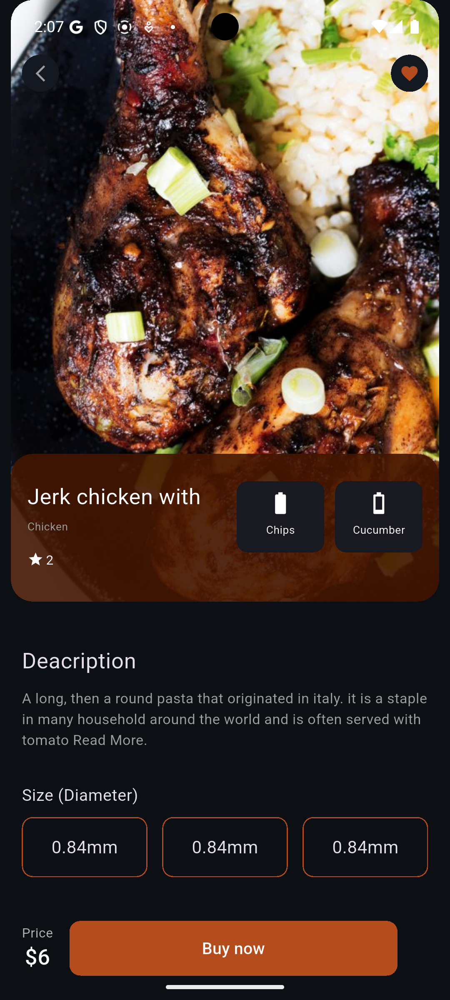
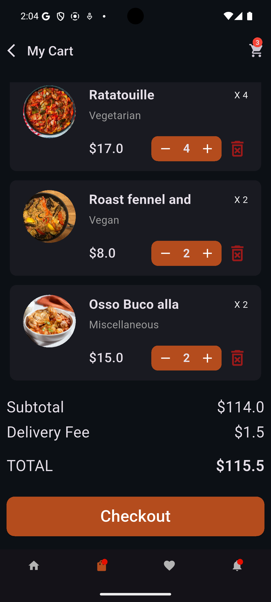
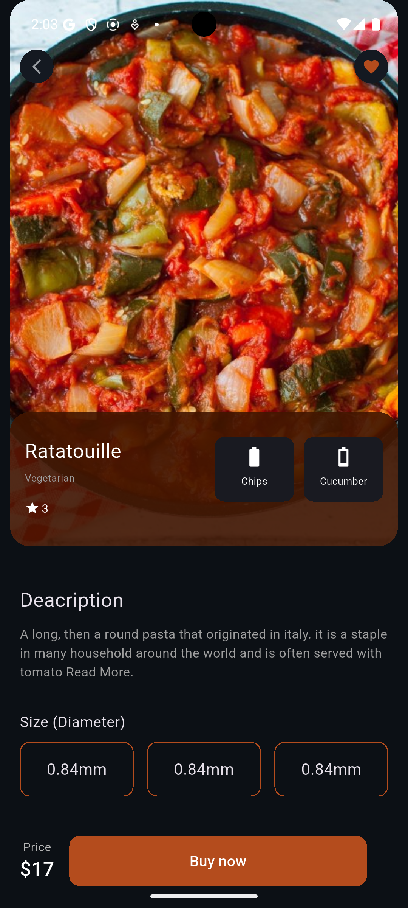

# mobile_food_app

# 🛒 Flutter E-Commerce App

A simple yet powerful **e-commerce mobile application** built with **Flutter**.  
Users can browse products, add/remove items from the cart, manage favorites, and adjust quantities — all powered by **Provider** for state management.

---

## ✨ Features

- 🏷️ Browse products with image, price, and rating
- 🛒 Add to cart & remove from cart
- ➕➖ Increase & decrease product quantity
- ❤️ Add or remove items from favorites
- 🔄 Real-time cart & favorites updates with **Provider**
- 📱 Responsive design for mobile screens

---

## 🎥 Demo

or a quick preview:


<p align="center">
    
</p>

---

## 📸 Screenshots

<p align="center">
                                    
</p>

---

<p align="center">
                                    
</p>

---

## 🛠️ Tech Stack

- [Flutter](https://flutter.dev/) (Dart)
- [Provider](https://pub.dev/packages/provider) for state management
- Material UI & Custom Widgets

---

## 🚀 Getting Started

### Prerequisites

- Install [Flutter](https://docs.flutter.dev/get-started/install) SDK
- A connected device or emulator

### Installation

```bash
# Clone the repository
git clone https://github.com/your-username/flutter-ecommerce-app.git

# Navigate into the project
cd mobile_food_app

# Get dependencies
flutter pub get

# Run the app
flutter run

```
